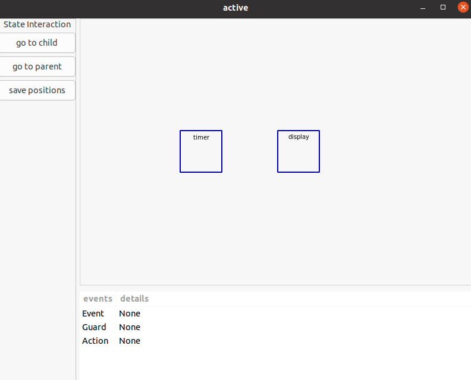
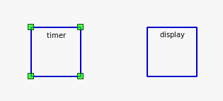
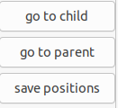
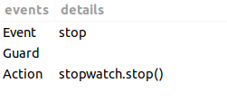

# Pychart - Thomas Brunet - Interactive Visualization For Statechart
## Introduction

Pychart is a university project, for the university of Lille.  

### what is it about

Sismic is a tool for statechart interpretation and visualisation but there is no tool where the visualisation is interactive, a statechart can have a lot of states all through different layers.

the visualization can become really difficult if the number of states is really important

this tool is to make the comprehension easier.

### Goal

the goal is to build a tool where you can navigate between the states, and see the transactions.

to have a interactive visualization of the statechart
### Current Status

the project is at the very beginning of it (pre-alpha)
there is all you can do like optimisation using layout algorithms

## Install the tool

* you need to have Gtk 3 (installed by default in ubuntu 20.04 LTS) but if its not use this command :
**sudo apt-get install libgtk-3-dev**

You need to install sismic and gaphas to do so use the following commands :
* **You need to have python 3.8 at least**  
before doing this update pip to the lastest version **/usr/bin/python3 -m pip install --upgrade pip** 
* **pip install sismic**
* **pip install gaphas**  
Now you can use the tool by cloning the depot : https://github.com/Mahote/Pychart
* python3 pychart.py [path to the yaml file]

## How work the tool

**First you need to have a yaml file that past true the validation**

here is examples of valide yaml statecharts :
* [stopwatch example](doc/examples/stopwatch.yaml) 
* [elevator example](doc/examples/elevator.yaml)

for more information on the statechart validation you can check the sismic documentation here : https://sismic.readthedocs.io/en/latest/format.html.  
The only thing that changes are the position in the yaml but there are optional.

When you have a correct yaml file you can now use pychart using the following commands :  
you need to be in the git repo of course  
* python3 pychart.py [path to the yaml file]

if you did all the thing above correctly you will have a window like this : 

to navigate through you statechart you need to select the state on which you want to see the child or the parent (if nothing happen then there is no child or you are already at the root state)

selection example :   

now you can click on the go to child or go to parent button  

by holding the left mouse click when you select a box you can drag it and position it where you want, same behaviors for the arrows.  
After the position is to your taste you can press the save positions button it will save the boxes positions into the yaml

when you click on an arrow informations are displayed in the bottom of the window like this :  

## Tools used for the development
* gaphas : https://gaphas.readthedocs.io/en/stable/
* Gtk (version 3.0): https://python-gtk-3-tutorial.readthedocs.io/en/latest/

* sismic : https://sismic.readthedocs.io/en/latest/

## Credits

* Giussepe Lipari researcher in the Cristal team in the University of Lille, who trust me for this project and helped me in various thing through the adventure.